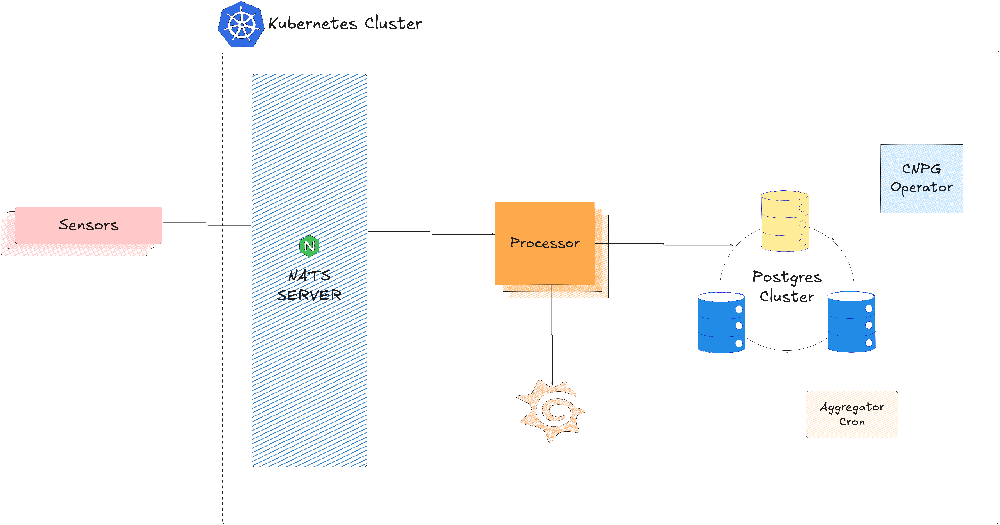

# Phylax - Sensor Monitoring System

Phylax is a high-velocity IoT monitoring platform designed to ingest, process, and store massive streams of sensor data with minimal latency. Built in Go, it leverages NATS JetStream to decouple rapid ingestion from storage, buffering millions of events before efficiently flushing them to PostgreSQL in optimized batches using `pgx` copy protocols. The system is architected for scale on Kubernetes using Helm charts and CloudNativePG, with a comprehensive observability layer powered by Prometheus and Grafana to track throughput, data lag, and sensor health in real-time.

## Tech Stack

- Protobuf - Compact message serialization.
- NATS JetStream - Low-latency, persistent message streaming.
- K8s and Helm - Container orchestration and package management.
- CloudNativePG: Production-grade PostgreSQL automation on K8s.

## Architecture

- **NATS Server:** Serves as an ingestion layer. Provinding a light-weight persistent message broker.
- **Processor:** Consumes messages from NATS stream and processes batches of messages concurrently using a worker pool. Batches are flushed to the DB when a memory limit is exceeded or after a time interval. Processors exposes metrics to be scraped by Prometheus and Grafana.
- **Postgress Cluster:** Is controlled by CloudNativePG and stores raw sensor data. To conserve space an aggregation CronJob compresses raw data into hourly summaries and purges old raw records
